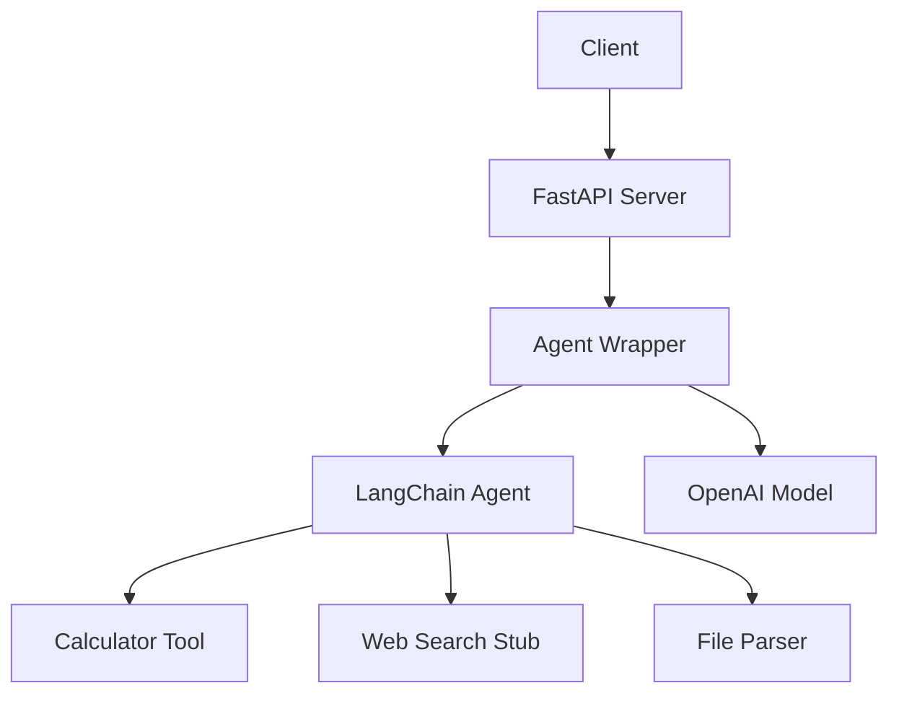

**Requires Python 3.11+**

# FastAPI + LangChain LLM Agent Starter Kit

[](https://finchey88.gumroad.com/l/fastapi-langchain-agent)


Kickstart your next AI project with a **production-ready FastAPI + LangChain template**.

This starter kit gives you a **sync** (beginner-friendly) LLM agent with:
- 🔢 Calculator tool
- 🌐 Web search stub (ready to plug into any search API)
- 📂 File parser tool (txt / md, easy to extend)
- 🐳 Docker + Docker Compose
- ✅ Example tests + GitHub Actions CI
- 🔐 `.env` configuration via Pydantic

Perfect for:
- Prototyping new AI products
- Hackathons and demos
- Learning LangChain + FastAPI
- Building your own agents and tools

---

## What you'll get

- A complete FastAPI + LangChain agent microservice  
- A working synchronous agent endpoint using a clean invoke pattern  
- Fully configured CI with pytest, Black, isort, Ruff, and caching  
- Environment-based settings using pydantic-settings  
- Production-ready folder structure and Docker setup  
- Example tools (calculator, web search stub, file parser)  
- Example tests and CI pipeline  
- `.env.example` for safe configuration  
- Free lifetime updates to the Gumroad version  

---

## Who is this for?

This starter kit is designed for developers, data engineers, ML engineers, and indie hackers who want to ship AI-powered APIs quickly and reliably.  
If you work with FastAPI, LangChain, or LLM-based tools, this provides a clean foundation for building real-world features without boilerplate.

---

## Why I built this

A lot of LangChain examples online are fragmented, outdated, or not structured for real projects.  
I built this starter kit to provide a clean, stable starting point that follows real engineering principles—so you can focus on your agent, not dependency issues or project scaffolding.

---

## FAQ

**Do I need an API key?**  
Yes. You will need an API key for the LLM provider you choose (OpenAI, Gemini, etc.).

**Can I use this for commercial work?**  
Yes. You are free to use this in client and commercial projects.

**Do tests require an API key?**  
No. All tests run entirely offline.

**Do I get updates?**  
Yes. All Gumroad buyers receive free lifetime updates to the template.

---

## Want the full packaged version?

A packaged ZIP with updates is available here:  
**https://finchly380.gumroad.com/l/fastapi-langchain-agent**

---

---

## Features

- **FastAPI backend**  
  Clean, extensible API with `/health` and `/agent/invoke`.

- **LangChain agent**  
  Zero-shot ReAct-style agent wired with three example tools.

- **Sync implementation**  
  Easy to read, easy to extend, ideal for beginners and fast prototyping.

- **Docker-first**  
  `Dockerfile` + `docker-compose.yml` for consistent dev and deployment.

- **Config via `.env`**  
  Pydantic `Settings` for environment-aware configuration.

- **CI pipeline**  
  GitHub Actions workflow to run tests on every push / PR.

- 🧪 Simple, CI-friendly test suite (no API key required)

---

## Quickstart

If you just want to run the project immediately:

```bash
python3 -m venv .venv
source .venv/bin/activate      # or .venv\Scripts\activate on Windows
pip install --upgrade pip
pip install -r requirements.txt
python -m uvicorn app.main:app --reload --port 8000
```

## Running Tests

This project includes a minimal test suite to verify that the API starts correctly.

To run tests:

```bash
pytest
```

Tests do **not** require an OpenAI API key and will pass in any environment, including CI.

Open the interactive API docs at:  
**http://localhost:8000/docs**

---

## Example API Requests

### Invoke the agent

**POST** `/agent/invoke`

**Request:**
```json
{
  "input": "Use the calculator tool to compute 5 * (3 + 2)."
}
```

**Response:**
```json
{
  "output": "The result is 25."
}
```

### Root route

**GET** `/`

Returns a simple landing message:

```json
{
  "message": "LLM Agent Starter Kit API",
  "docs_url": "/docs",
  "health_url": "/health"
}
```

---

### Health check

**GET** `/health`

**Example response:**
```json
{
  "status": "ok",
  "environment": "local"
}
```

---

## Architecture Overview



---

## What's Inside (File-by-file)

```
llm-agent-starter/
│
├── app/
│   ├── main.py           # FastAPI routes & app setup
│   ├── agent.py          # LangChain agent wiring
│   ├── config.py         # Pydantic settings loader
│   ├── schemas.py        # Request/response models
│   └── tools/
│       ├── calculator.py # Arithmetic tool
│       ├── web_search.py # Search API stub
│       └── file_parser.py# Local file reader
│
├── tests/
│   └── test_agent.py     # Basic health check test for CI
│
├── .env.example          # Environment variable template
├── requirements.txt       # Python dependencies
├── Dockerfile             # Docker build
├── docker-compose.yml     # Compose config
├── Makefile               # Dev automation commands
└── .github/workflows/
    └── ci.yml            # GitHub Actions CI pipeline
```

---

## Getting Started

### 0. Create and activate a virtual environment

It is recommended to use a Python virtual environment before installing dependencies.

```bash
python3 -m venv .venv
source .venv/bin/activate   # Mac/Linux
# On Windows:
.venv\Scripts\activate
pip install --upgrade pip
```

### Installing development tools

If you want linting and formatting support, install developer dependencies:

```bash
pip install -r requirements-dev.txt
```

### Deactivate the virtual environment

When you're done working in the project, you can deactivate the environment:

```bash
deactivate
```

### 1. Clone the repo

```bash
git clone <your-repo-url> llm-agent-starter
cd llm-agent-starter```